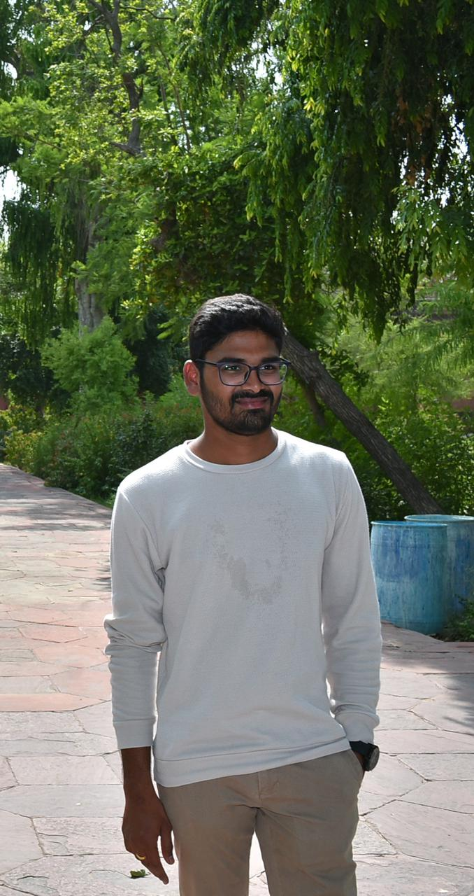

# TejeswaraRao Pathuri
I am from India. Currently pursuing my masters at NorthWest Missouri State University in Applied Computer Science. I have done my under graduation in KKR & KSR Institute of Technology and Sciences. After my under graduation I have worked for an year as an Java Developer. Apart from this I am a state cricket player.

[Link to the Image](https://github.com/tejapathuri/assignment2-Pathuri/blob/main/Teja.png)

****
## Recommended Cities to visit
|   Name of the City  |        Important Locations     | Amount of time to spend visiting | 
|:--------------------|:------------------------------ |:---------------------------------|
|       Vizag         |  Indira Gandhi Zoological Park |      1 day                       |
|      chennai        |  Kapaleeshwarar Temple         |      3 hours                     |
|      Hyderabad      |  Charminar                     |      1 hour                      |
|      Banglore       |  Lalbagh Botanical Garden      |      6 hours                     |

